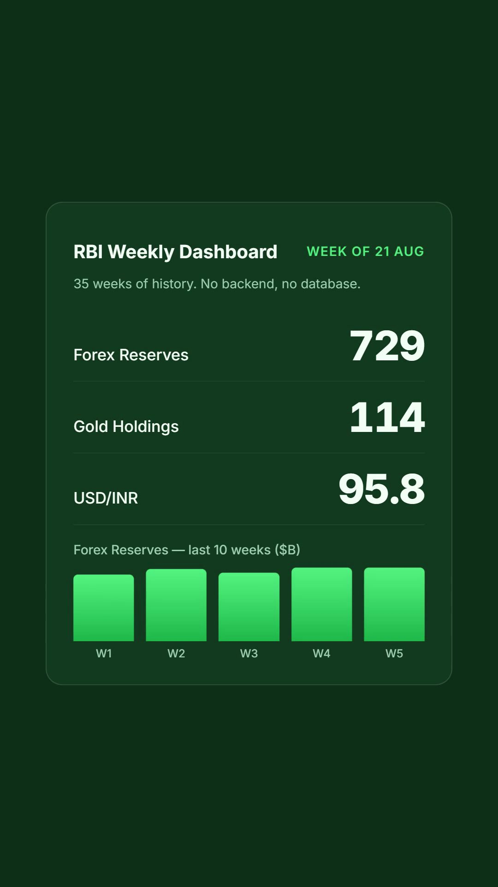

# RBI Weekly Dashboard

A simple dashboard that gathers the Reserve Bank of India's weekly updates — foreign exchange reserves, gold holdings, the value of the rupee, and how the stock market is doing — and puts them all in one easy-to-read place.

## Watch it

A 30-second trailer — click the poster to play:

[](brag-output/brag.mp4)

## Why it exists

Every week the RBI publishes a new report as a raw spreadsheet. This project keeps a **history** of those numbers, so instead of digging through old files you can see the story at a glance:

- Is gold going up or down?
- Is the rupee getting stronger or weaker?
- What did the stock market do last Friday?
- How do the latest figures compare with the week before?

## What you can see

- **Key numbers at a glance** — reserves, gold, rupee vs the dollar and euro, and the main market indexes
- **Weekly change** — whether each number moved up or down versus the previous week
- **Charts and tables** — trend lines for the last 10 weeks, plus a searchable history
- **Extra context** — crude-oil import estimates, investor (FII) flow, interest rates, and more
- **World's biggest borrowers** — a quarterly cross-country ranking of external-debt stocks from the World Bank's Quarterly External Debt Statistics (countries' official IMF SDDS/GDDS submissions), with India's rank highlighted — the USA borrows the most, India sits in the low-#20s — plus a debt-to-reserves cover comparison (India's tile uses the dashboard's own weekly RBI reserves), India's short- vs long-term maturity split, and India's borrower rank reconstructed quarter by quarter since 2021
- **A PM CARES section** — a snapshot of the COVID-era relief fund from its audited accounts

## How it stays up to date

The data refreshes automatically. A small automated job checks for the latest RBI report each day — and re-pulls the World Bank borrower ranking — updating the dashboard on its own. The ranking is also refreshed from the live World Bank API on every deploy, and the in-page Reload button always bypasses caches.

## Run it locally

You'll need **Node.js** (version 18 or newer).

```
npm install
npm run fetch:data
```

Then open the `public` folder in any browser (or serve it with a local server). The dashboard reads the freshly generated data file.

Quick checks: `npm run check` verifies the syntax of every script in the repo.

## Built with

A hand-written **HTML / CSS / JavaScript** site hosted on **Netlify**, with a bit of **Node** automation behind the scenes that fetches the reports and tidies the numbers. No database, no accounts, no sign-up.

---

*Data for reference and personal use. Figures correspond to weekly RBI reporting dates.*
